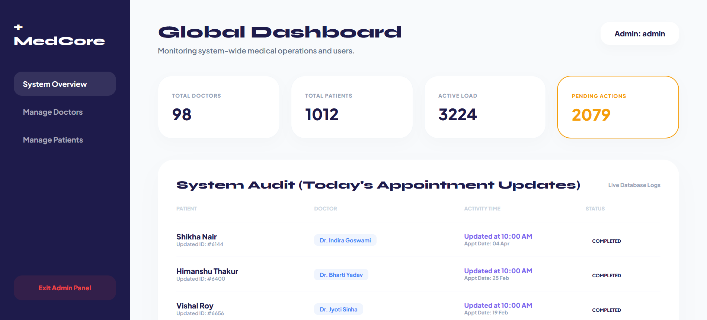
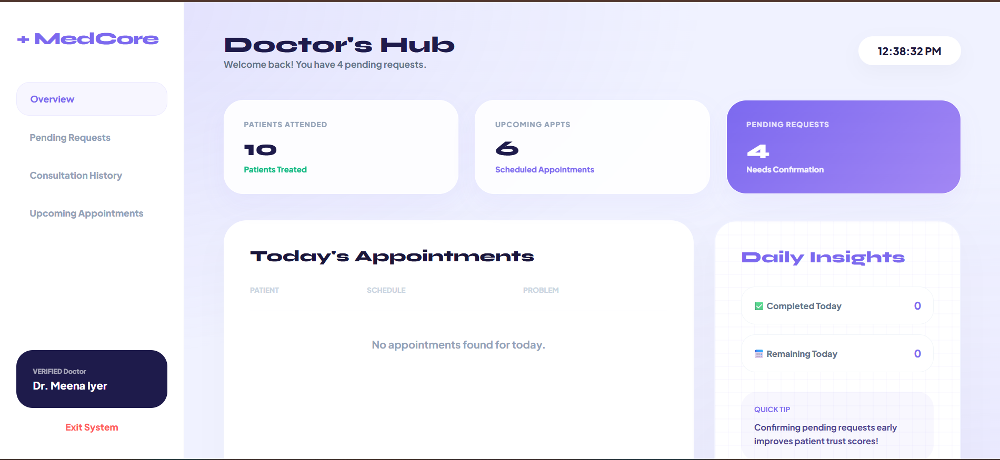
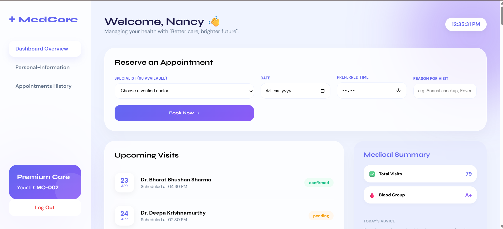

<h1 align="center">🏥 MedCore</h1>
<h3 align="center">🚀 Multi-Dashboard Hospital Management System</h3>

---

<p align="center">
  <a href="https://16.170.208.202/register.php">
    
  </a>
</p>

---

## 🧠 About Project

MedCore is a **web-based Hospital Management System** designed with a **multi-role architecture**.

The system provides **three separate dashboards** for different users:

* 👩‍💼 **Admin Dashboard**
* 👨‍⚕️ **Doctor Dashboard**
* 🧑‍🤝‍🧑 **Patient Dashboard**

Each dashboard is customized for its role, ensuring efficient hospital workflow management.

---

## 🎯 Dashboards Overview

### 👩‍💼 Admin Dashboard

* Manage doctors and patients
* View system analytics
* Handle pending requests
* Monitor appointments

<p align="center">
  
</p>

---

### 👨‍⚕️ Doctor Dashboard

* View assigned patients
* Check appointment schedule
* Maintain consultation history

<p align="center">
  
</p>

---

### 🧑‍🤝‍🧑 Patient Dashboard

* Register & login
* Book appointments
* View medical history
* Update profile

<p align="center">
  
</p>

---

## ✨ Key Features

* 🔐 Role-Based Authentication
* 📅 Appointment Management
* 📊 Dashboard Insights
* 📁 Medical Records System
* ⚡ Fast & Simple UI

---

## ⚙️ Tech Stack

<p align="center">
  
</p>

---

## 🚀 Installation

```bash
git clone https://github.com/Mansi114114/MedCore.git
```

Move to:

```
C:\xampp\htdocs\
```

Import database using phpMyAdmin

Run:

```
http://localhost/MedCore
```

---

## 🌐 Live Demo

👉 https://16.170.208.202/register.php

---

## 👩‍💻 Developer

**Mansi Mishra**
🎓 B.Tech CSE Student

---

## ⭐ Support

If you like this project, give it a ⭐ on GitHub!
